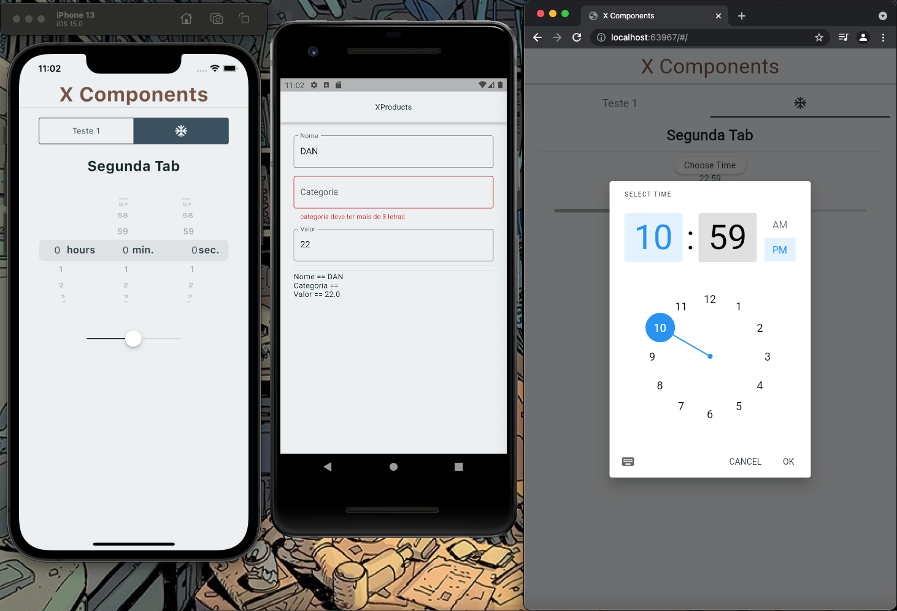

# xcomponents

Detecta a plataforma e desenha a UI de acordo com os parametros nativos de Cupertino ou Material

## Interface

```

abstract class DetectPlataform<A extends Widget, I extends Widget,
    W extends Widget> extends StatelessWidget {
  @override
  Widget build(BuildContext context) {
    if (defaultTargetPlatform == TargetPlatform.android) {
      return createAndroidWidget(context);
    } else if (defaultTargetPlatform == TargetPlatform.iOS) {
      return createIosWidget(context);
    } else {
      return createWebWidget(context);
    }
  }

  I createIosWidget(BuildContext context);
  A createAndroidWidget(BuildContext context);
  W createWebWidget(BuildContext context);
}


```

## Exemplo de Widget

```

class XScaffold
    extends DetectPlataform<Scaffold, CupertinoPageScaffold, Scaffold> {
  final Widget body;
  final dynamic appBar;
  final Color? backgroundColor;

  XScaffold({
    required this.body,
    this.appBar,
    this.backgroundColor,
  });

  @override
  Scaffold createAndroidWidget(BuildContext context) {
    return Scaffold(
      appBar: appBar as AppBar,
      body: body,
      backgroundColor: backgroundColor,
    );
  }

  @override
  CupertinoPageScaffold createIosWidget(BuildContext context) {
    return CupertinoPageScaffold(
      child: body,
      navigationBar: appBar as CupertinoNavigationBar,
      backgroundColor: backgroundColor,
    );
  }

  @override
  createWebWidget(BuildContext context) {
    return Scaffold(
      appBar: appBar as AppBar,
      body: body,
      backgroundColor: backgroundColor,
    );
  }
}

```


